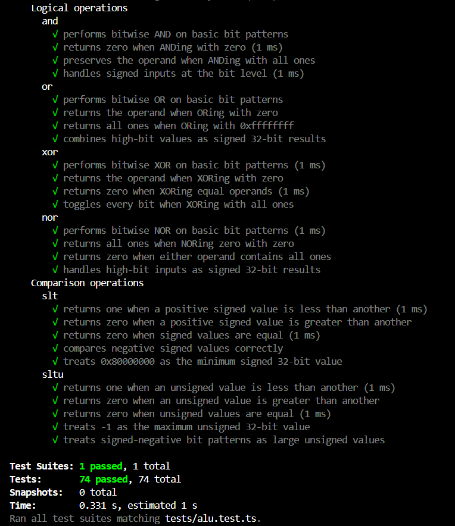
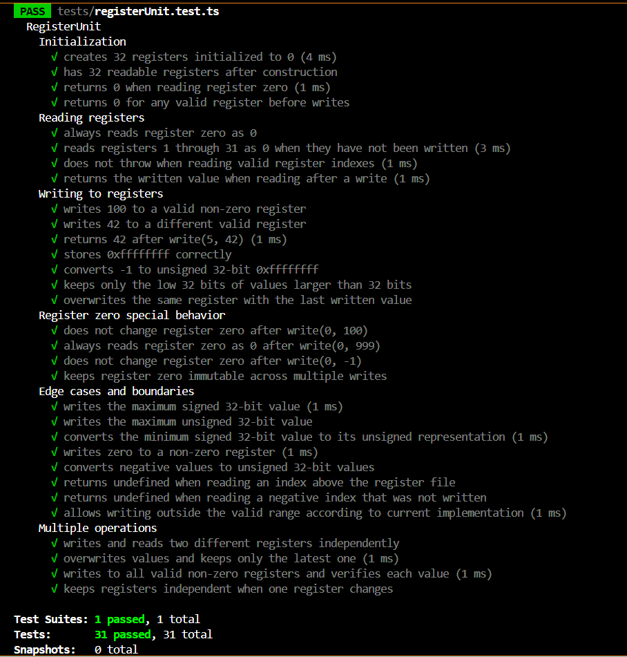
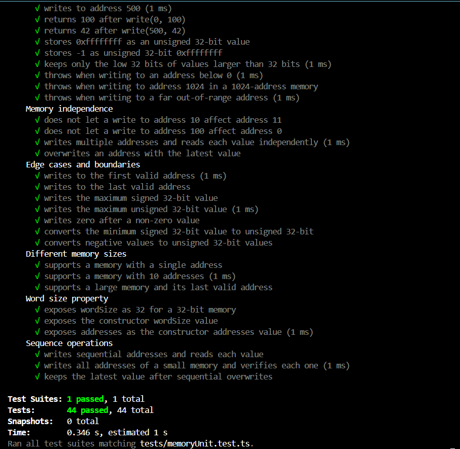

JS library to compile and run hex instructions.

# WORKFLOW OUTLINE

The library is to be used as follows:

    1. The user instances any Compiler class by loading it with a Program. The Compiler constructor expects a single string. Said string is to have a format of space-separated hex values, with or without the '0x' prefix (every hex word is an instruction). The Compiler constructor takes that and instances the Program class with it.

    2. The user then calls one of the following:
        > singleCycleExec()
        > pipelinedExec()
        > pipelinedProtectedExec()
    and passes the Compiler instance as an argument. Whichever one the user calls determines what the output is. Any one of these is a central 'execute()' function.

The output of the library includes the final state of the RegisterUnit, the number of cycles and execution time.

# DEVELOPMENT DETAILS

This library is written in TypeScript. Its unit tests are to be done with jest and ts-jest. It is to be bundled with tsup. 

# ALU UNIT TESTS

A unit test suite was added for the ALU in `tests/alu.test.ts`. The goal of this test file is to validate the behavior of the arithmetic logic unit independently from the rest of the processor, so each ALU method is checked directly with controlled inputs and expected outputs.

The suite is organized under the `ALU Operations` describe block and covers:

1. Signed arithmetic operations: `add`, `sub`, `mul`, `muh`, `div`, and `mod`.
2. Unsigned arithmetic operations: `addu`, `subu`, `mulu`, `mulhu`, `divu`, and `modu`.
3. Logical operations: `and`, `or`, `xor`, and `nor`.
4. Comparison operations: `slt` and `sltu`.

Each operation includes tests for normal positive values, negative values when applicable, zero values, 32-bit boundary cases, overflow or wraparound behavior, and division-by-zero errors.

## What These Tests Mean

These tests confirm that the ALU behaves like a 32-bit MIPS-style execution unit:

- Signed operations interpret operands as signed 32-bit integers.
- Unsigned operations interpret operands as values from `0` to `0xffffffff`.
- Multiplication tests verify both low 32-bit results and high 32-bit results.
- Division truncates toward zero.
- Modulo keeps the expected JavaScript/MIPS-style signed remainder behavior.
- Logical operations work at the bit level.
- `slt` and `sltu` correctly distinguish signed and unsigned comparisons.

During testing, the unsigned `addu` and `subu` operations exposed missing 32-bit wraparound behavior. Their return values were adjusted in `src/core/hardware/alu.ts` using `>>> 0`, so unsigned results remain inside the 32-bit range.

## Test Result

The ALU test suite was executed with:

```bash
npm test -- tests/alu.test.ts --runInBand
```

Expected result:

```text
Test Suites: 1 passed, 1 total
Tests:       74 passed, 74 total
Snapshots:   0 total
```

This result means all 74 ALU unit tests passed successfully, so the tested operations match the expected 32-bit behavior.

## Test Evidence Screenshot



# REGISTERUNIT UNIT TESTS

A unit test suite was added for the register file simulator in `tests/registerUnit.test.ts`. The goal of this test file is to validate the `RegisterUnit` class independently from instruction decoding, ALU execution, memory, or full processor execution.

The suite is organized under the `RegisterUnit` describe block and covers:

1. Initialization of a standard 32-register MIPS register file.
2. Reading valid registers before and after writes.
3. Writing unsigned 32-bit values to registers 1 through 31.
4. Special behavior of register index 0, the MIPS `$zero` register.
5. Boundary values such as `0xffffffff`, `0x80000000`, negative numbers, and zero.
6. Multiple operations, overwrites, and independence between registers.
7. Current out-of-range behavior for indexes outside the 0-31 range.

## What This Test Means

These tests confirm that `RegisterUnit` behaves like the register bank expected by the MIPS v6 processor simulator:

- A new register unit starts with all valid registers initialized to `0`.
- Register `0` acts like `$zero`: attempted writes are ignored and reads always return `0`.
- Values written to normal registers are converted to unsigned 32-bit integers with `>>> 0`.
- Negative numbers are stored as their 32-bit unsigned representation.
- Updating one register does not modify unrelated registers.
- Repeated writes keep the last written value.

The tests also document an implementation detail that may be important later: the current class does not reject indexes outside the MIPS register range. Reading an unwritten invalid index returns `undefined`, while writing index `32` stores a value at that array position.

## Test Result

The RegisterUnit test suite was executed with:

```bash
npm test -- tests/registerUnit.test.ts --runInBand
```

Expected result:

```text
Test Suites: 1 passed, 1 total
Tests:       31 passed, 31 total
Snapshots:   0 total
```

This result means all 31 RegisterUnit unit tests passed successfully, so the tested register initialization, reading, writing, `$zero`, and 32-bit conversion behavior match the expected behavior.

## Test Evidence Screenshot



# MEMORYUNIT UNIT TESTS

A unit test suite was added for the memory simulator in `tests/memoryUnit.test.ts`. The goal of this test file is to validate the `MemoryUnit` class independently from instruction decoding, register behavior, ALU execution, or full processor execution.

The suite is organized under the `MemoryUnit` describe block and covers:

1. Initialization of memory with 32-bit words and 1024 addresses.
2. Validation that all addresses start initialized to `0`.
3. Reading valid addresses before and after writes.
4. Writing unsigned 32-bit values to valid addresses.
5. Address bounds checking for negative addresses and addresses greater than or equal to the configured size.
6. Independence between memory addresses.
7. Boundary values such as `0xffffffff`, `0x80000000`, negative numbers, zero, first address, and last address.
8. Different memory sizes, including 1 address, 10 addresses, and 10000 addresses.
9. Public configuration properties: `wordSize` and `addresses`.
10. Sequential write/read operations and overwrites.

## What This Test Means

These tests confirm that `MemoryUnit` behaves like the bounded memory component expected by the MIPS v6 processor simulator:

- A new memory unit keeps the configured `wordSize` and `addresses`.
- Every valid memory address starts with value `0`.
- Valid reads and writes work inside the range `[0, addresses - 1]`.
- Invalid reads and writes throw `Error("Address out of bounds")`.
- Memory values are stored as unsigned 32-bit words because the implementation uses `Uint32Array`.
- Negative values and values larger than 32 bits are converted to their 32-bit unsigned representation.
- Writing one address does not affect neighboring or unrelated addresses.
- Repeated writes keep the latest value.

The constructor validation is also tested: `new MemoryUnit(32, 0)` and `new MemoryUnit(32, -5)` must throw `Error("Memory must have at least one address")`.

## Test Result

The MemoryUnit test suite was executed with:

```bash
npm test -- tests/memoryUnit.test.ts --runInBand
```

Expected result:

```text
Test Suites: 1 passed, 1 total
Tests:       44 passed, 44 total
Snapshots:   0 total
```

This result means all 44 MemoryUnit unit tests passed successfully, so the tested memory initialization, reading, writing, bounds checking, address independence, and unsigned 32-bit storage behavior match the expected behavior.

## Test Evidence Screenshot



