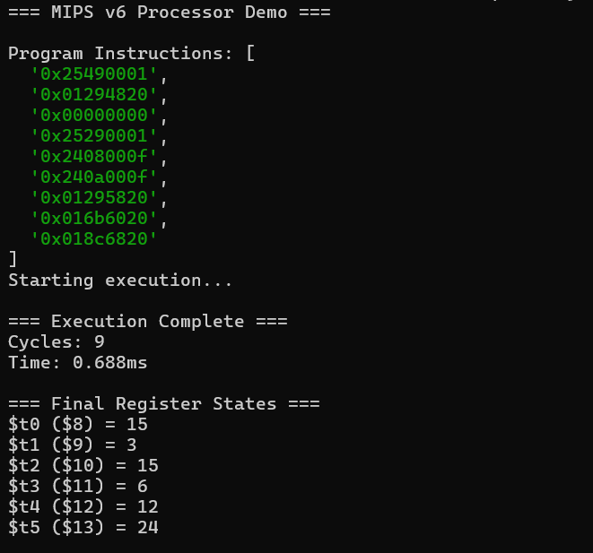
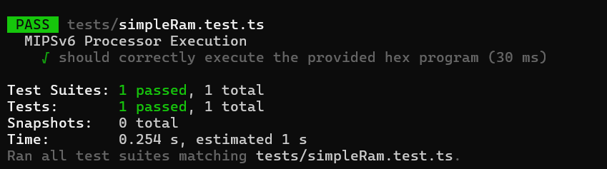
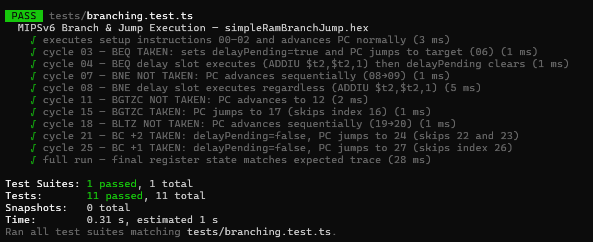
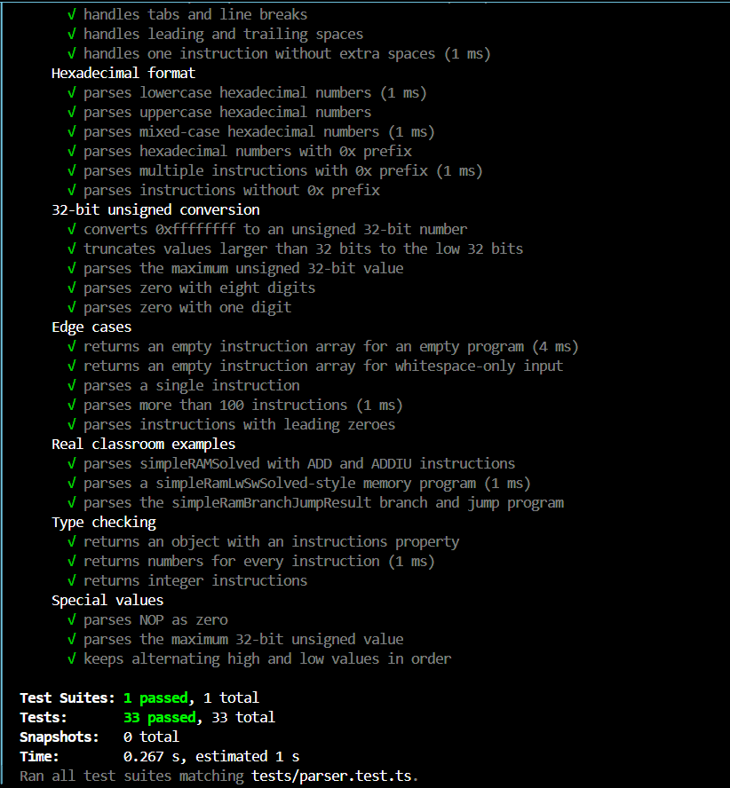
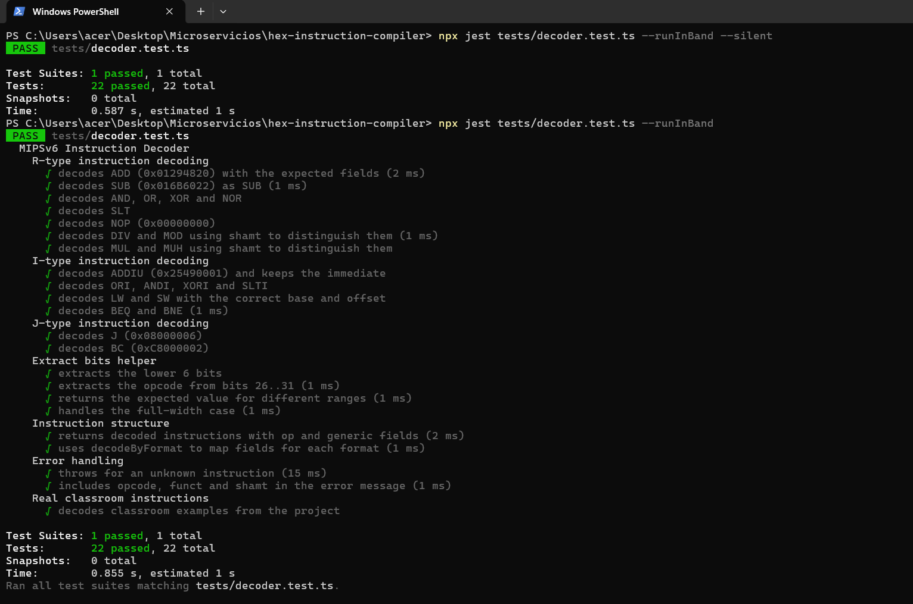
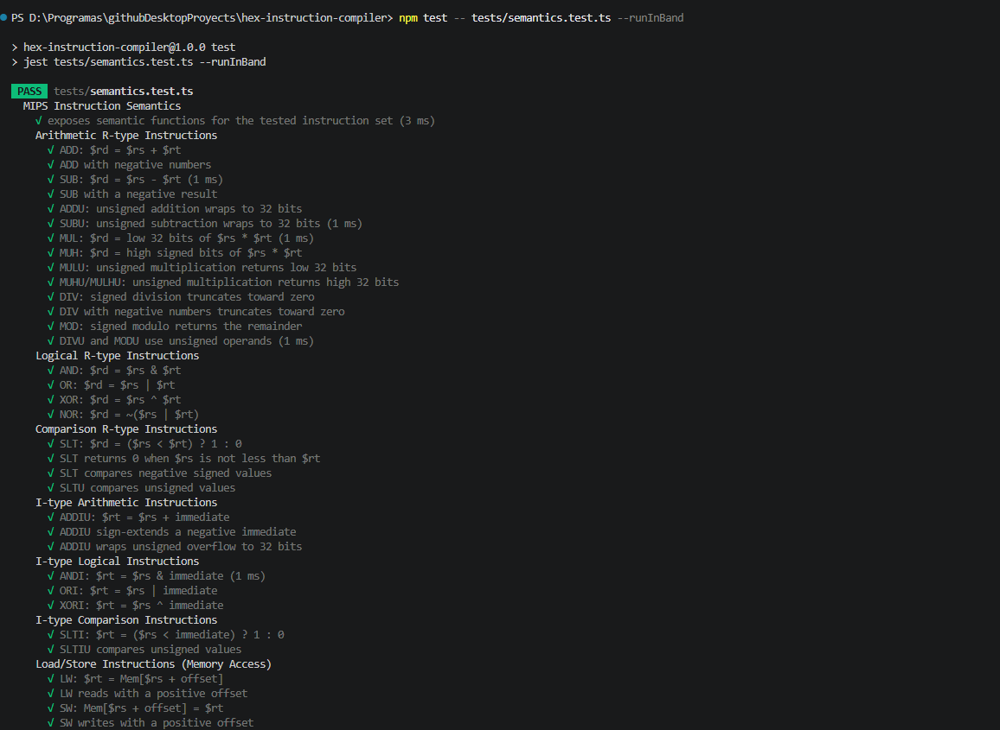
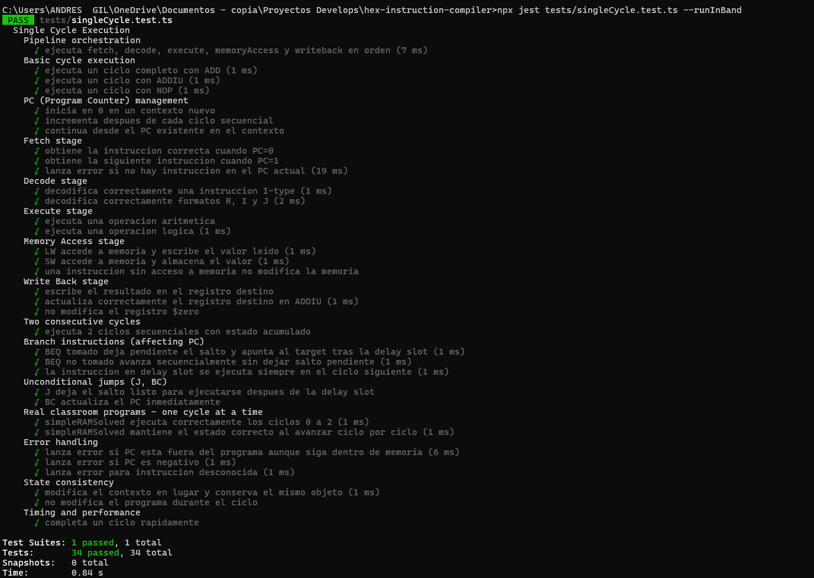
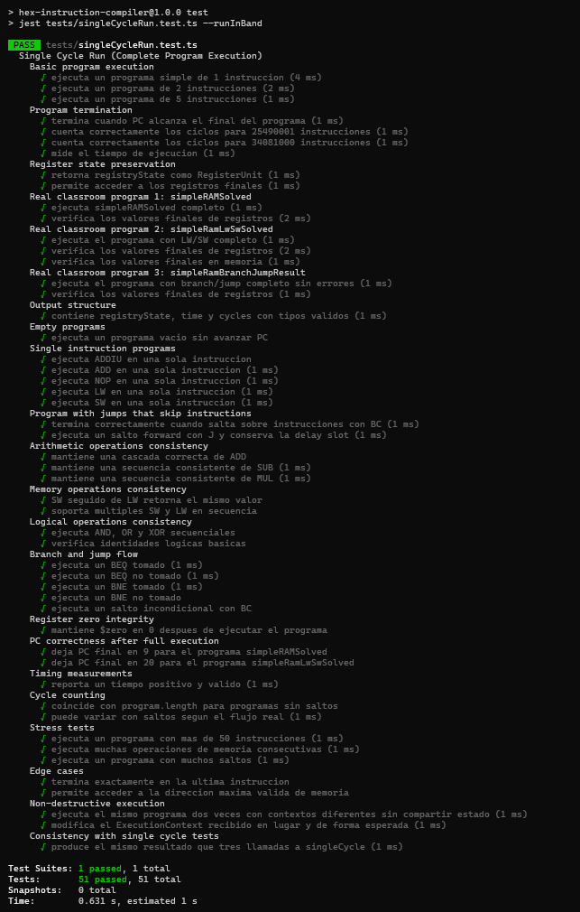

# DEMO EXECUTION

An executable demo was added in `src/demo.ts`. This file is not a Jest test; it is a usage example that runs a real MIPS v6 hexadecimal program through the library.

The demo shows the complete execution flow:

1. Import the public API from `src/index.ts`.
2. Define a MIPS v6 program as a space-separated hexadecimal string.
3. Parse the program with `parseHexProgram`.
4. Create a `MIPSv6Processor`.
5. Create an execution context with `RegisterUnit`, `MemoryUnit`, and `pc = 0`.
6. Execute the program with `singleCycleRun`.
7. Print the parsed instructions, cycle count, execution time, and final register values.

## How To Run The Demo

From the project root, run:

```bash
npx tsx src/demo.ts
```

If you want to make this command easier to reuse, add this script to `package.json`:

```json
"demo": "tsx src/demo.ts"
```

Then run:

```bash
npm run demo
```

## What This Demo Means

The demo confirms that the main library pieces work together in a realistic execution flow:

- `parseHexProgram` converts the hex string into a `Program`.
- `MIPSv6Processor` executes the decoded instructions.
- `RegisterUnit` stores the final register values.
- `MemoryUnit` provides memory for the execution context.
- `singleCycleRun` runs the full program and reports cycles plus execution time.

The expected output includes 9 executed cycles and these final register values:

```text
$t0 ($8) = 15
$t1 ($9) = 3
$t2 ($10) = 15
$t3 ($11) = 6
$t4 ($12) = 12
$t5 ($13) = 24
```

These values mean the hexadecimal program was parsed and executed correctly, producing the same final register state used by the classroom `simpleRAMSolved` example.

## Demo Evidence Screenshot



# SIMPLERAM INTEGRATION TEST

An integration test exists in `tests/simpleRam.test.ts`. This test validates that the processor can parse and execute the classroom `simpleRAMSolved` hexadecimal program from start to finish.

The test uses the public project API:

1. `parseHexProgram` converts the hexadecimal string into a `Program`.
2. `MIPSv6Processor` creates the processor instance.
3. `RegisterUnit` creates the 32-register MIPS register file.
4. `MemoryUnit` creates memory with 32-bit words and 1024 addresses.
5. `singleCycleRun` executes the complete program.
6. Jest assertions verify the final register values.

## What This Test Means

This test confirms that the main pieces of the simulator work together for a real MIPS v6 program:

- The parser converts the hex instructions correctly.
- The processor executes all instructions through the single-cycle runner.
- Register writes happen in the expected destinations.
- The final state matches the known classroom result.

The expected final register values are:

```text
$t0 = 15
$t1 = 3
$t2 = 15
$t3 = 6
$t4 = 12
$t5 = 24
```

These values mean the program executed correctly and produced the expected arithmetic/register state.

## Test Result

The simple RAM integration test was executed with:

```bash
npm test -- tests/simpleRam.test.ts --runInBand
```

Verified result:

```text
Test Suites: 1 passed, 1 total
Tests:       1 passed, 1 total
Snapshots:   0 total
```

This result means the classroom `simpleRAMSolved` program passed successfully as a full parse-and-execute scenario.

## Test Evidence Screenshot



# BRANCHING INTEGRATION TEST

An integration test exists in `tests/branching.test.ts`. This test validates the classroom `simpleRamBranchJump.hex` program, which focuses on branch and jump behavior across individual cycles and full-program execution.

The test checks the control-flow behavior of:

1. `BEQ` taken with a delay slot.
2. `BNE` not taken with its delay-slot instruction still executed.
3. `BGTZC` not taken without a delay slot.
4. `BGTZC` taken without a delay slot.
5. `BLTZ` not taken with delay-slot behavior.
6. `BC` unconditional compact branches that skip instructions.
7. Final register state after running the complete branch/jump program.

## What This Test Means

This test confirms that the simulator handles MIPS control flow correctly:

- Sequential setup instructions advance `pc` normally.
- Taken branches store the expected jump target.
- Delay-slot instructions execute when required.
- Compact branches skip delay-slot behavior.
- Skipped instructions do not modify registers.
- A full run ends with the expected final register trace.

The final expected register values are:

```text
$t0 = 0x00000005
$t1 = 0x00000005
$t2 = 0x00000004
$t3 = 0x00000001
$t4 = 0x00000002
$t5 = 0xffffffff
$t6 = 0x00000009
$t7 = 0x00005555
$t8 = 0x00003333
$t9 = 0x00000000
```

The `$t2` value is especially important: it works as a branch accumulator and proves that only the expected delay-slot or fall-through increments executed.

## Test Result

The branching integration test was executed with:

```bash
npm test -- tests/branching.test.ts --runInBand
```

Verified result:

```text
Test Suites: 1 passed, 1 total
Tests:       11 passed, 11 total
Snapshots:   0 total
```

This result means all 11 branch/jump tests passed successfully, so the tested PC flow, delay-slot behavior, compact branches, skipped instructions, and final register state match the expected behavior.

## Test Evidence Screenshot




# ALU UNIT TESTS

A unit test suite was added for the ALU in `tests/alu.test.ts`. The goal of this test file is to validate the behavior of the arithmetic logic unit independently from the rest of the processor, so each ALU method is checked directly with controlled inputs and expected outputs.

The suite is organized under the `ALU Operations` describe block and covers:

1. Signed arithmetic operations: `add`, `sub`, `mul`, `muh`, `div`, and `mod`.
2. Unsigned arithmetic operations: `addu`, `subu`, `mulu`, `mulhu`, `divu`, and `modu`.
3. Logical operations: `and`, `or`, `xor`, and `nor`.
4. Comparison operations: `slt` and `sltu`.

Each operation includes tests for normal positive values, negative values when applicable, zero values, 32-bit boundary cases, overflow or wraparound behavior, and division-by-zero errors.

## What These Tests Mean

These tests confirm that the ALU behaves like a 32-bit MIPS-style execution unit:

- Signed operations interpret operands as signed 32-bit integers.
- Unsigned operations interpret operands as values from `0` to `0xffffffff`.
- Multiplication tests verify both low 32-bit results and high 32-bit results.
- Division truncates toward zero.
- Modulo keeps the expected JavaScript/MIPS-style signed remainder behavior.
- Logical operations work at the bit level.
- `slt` and `sltu` correctly distinguish signed and unsigned comparisons.

During testing, the unsigned `addu` and `subu` operations exposed missing 32-bit wraparound behavior. Their return values were adjusted in `src/core/hardware/alu.ts` using `>>> 0`, so unsigned results remain inside the 32-bit range.

## Test Result

The ALU test suite was executed with:

```bash
npm test -- tests/alu.test.ts --runInBand
```

Expected result:

```text
Test Suites: 1 passed, 1 total
Tests:       74 passed, 74 total
Snapshots:   0 total
```

This result means all 74 ALU unit tests passed successfully, so the tested operations match the expected 32-bit behavior.

## Test Evidence Screenshot


# REGISTERUNIT UNIT TESTS

A unit test suite was added for the register file simulator in `tests/registerUnit.test.ts`. The goal of this test file is to validate the `RegisterUnit` class independently from instruction decoding, ALU execution, memory, or full processor execution.

The suite is organized under the `RegisterUnit` describe block and covers:

1. Initialization of a standard 32-register MIPS register file.
2. Reading valid registers before and after writes.
3. Writing unsigned 32-bit values to registers 1 through 31.
4. Special behavior of register index 0, the MIPS `$zero` register.
5. Boundary values such as `0xffffffff`, `0x80000000`, negative numbers, and zero.
6. Multiple operations, overwrites, and independence between registers.
7. Current out-of-range behavior for indexes outside the 0-31 range.

## What This Test Means

These tests confirm that `RegisterUnit` behaves like the register bank expected by the MIPS v6 processor simulator:

- A new register unit starts with all valid registers initialized to `0`.
- Register `0` acts like `$zero`: attempted writes are ignored and reads always return `0`.
- Values written to normal registers are converted to unsigned 32-bit integers with `>>> 0`.
- Negative numbers are stored as their 32-bit unsigned representation.
- Updating one register does not modify unrelated registers.
- Repeated writes keep the last written value.

The tests also document an implementation detail that may be important later: the current class does not reject indexes outside the MIPS register range. Reading an unwritten invalid index returns `undefined`, while writing index `32` stores a value at that array position.

## Test Result

The RegisterUnit test suite was executed with:

```bash
npm test -- tests/registerUnit.test.ts --runInBand
```

Expected result:

```text
Test Suites: 1 passed, 1 total
Tests:       31 passed, 31 total
Snapshots:   0 total
```

This result means all 31 RegisterUnit unit tests passed successfully, so the tested register initialization, reading, writing, `$zero`, and 32-bit conversion behavior match the expected behavior.

## Test Evidence Screenshot


# MEMORYUNIT UNIT TESTS

A unit test suite was added for the memory simulator in `tests/memoryUnit.test.ts`. The goal of this test file is to validate the `MemoryUnit` class independently from instruction decoding, register behavior, ALU execution, or full processor execution.

The suite is organized under the `MemoryUnit` describe block and covers:

1. Initialization of memory with 32-bit words and 1024 addresses.
2. Validation that all addresses start initialized to `0`.
3. Reading valid addresses before and after writes.
4. Writing unsigned 32-bit values to valid addresses.
5. Address bounds checking for negative addresses and addresses greater than or equal to the configured size.
6. Independence between memory addresses.
7. Boundary values such as `0xffffffff`, `0x80000000`, negative numbers, zero, first address, and last address.
8. Different memory sizes, including 1 address, 10 addresses, and 10000 addresses.
9. Public configuration properties: `wordSize` and `addresses`.
10. Sequential write/read operations and overwrites.

## What This Test Means

These tests confirm that `MemoryUnit` behaves like the bounded memory component expected by the MIPS v6 processor simulator:

- A new memory unit keeps the configured `wordSize` and `addresses`.
- Every valid memory address starts with value `0`.
- Valid reads and writes work inside the range `[0, addresses - 1]`.
- Invalid reads and writes throw `Error("Address out of bounds")`.
- Memory values are stored as unsigned 32-bit words because the implementation uses `Uint32Array`.
- Negative values and values larger than 32 bits are converted to their 32-bit unsigned representation.
- Writing one address does not affect neighboring or unrelated addresses.
- Repeated writes keep the latest value.

The constructor validation is also tested: `new MemoryUnit(32, 0)` and `new MemoryUnit(32, -5)` must throw `Error("Memory must have at least one address")`.

## Test Result

The MemoryUnit test suite was executed with:

```bash
npm test -- tests/memoryUnit.test.ts --runInBand
```

Expected result:

```text
Test Suites: 1 passed, 1 total
Tests:       44 passed, 44 total
Snapshots:   0 total
```

This result means all 44 MemoryUnit unit tests passed successfully, so the tested memory initialization, reading, writing, bounds checking, address independence, and unsigned 32-bit storage behavior match the expected behavior.

## Test Evidence Screenshot


# PARSER UNIT TESTS

A unit test suite was added for the hexadecimal program parser in `tests/parser.test.ts`. The goal of this test file is to validate `parseHexProgram` independently from instruction execution, registers, memory, and the ALU.

The suite is organized under the `parseHexProgram Parser` describe block and covers:

1. Basic parsing of one or more hexadecimal instructions.
2. Whitespace handling with spaces, repeated spaces, tabs, line breaks, and leading/trailing spaces.
3. Hexadecimal formats in lowercase, uppercase, mixed case, with `0x` prefix, and without prefix.
4. Unsigned 32-bit conversion using `>>> 0`.
5. Empty input, whitespace-only input, long programs, and leading zeroes.
6. Real classroom examples such as `simpleRAMSolved`, a LW/SW-style memory program, and the branch/jump program.
7. Program return shape: an object with an `instructions` array.
8. Special instruction values such as `00000000` NOP and `FFFFFFFF`.

## What This Test Means

These tests confirm that `parseHexProgram` correctly transforms a textual hex program into the `Program` structure consumed by the simulator:

- Each hex word becomes a number in `instructions`.
- Instruction order is preserved.
- Empty words caused by whitespace are ignored.
- Tabs, new lines, and repeated spaces work as separators.
- Values are normalized to unsigned 32-bit instruction words.
- Real class programs are parsed with the expected number of instructions.

This is important because the parser is the first step before execution: if it changes instruction order, loses words, or produces signed/incorrect values, the processor tests can fail even when the CPU components are correct.

## Test Result

The parser test suite was executed with:

```bash
npm test -- tests/parser.test.ts --runInBand
```

Expected result:

```text
Test Suites: 1 passed, 1 total
Tests:       33 passed, 33 total
Snapshots:   0 total
```

This result means all 33 parser unit tests passed successfully, so the tested hex formats, whitespace handling, Program shape, classroom examples, and unsigned 32-bit conversions match the expected behavior.

## Test Evidence Screenshot



# DECODER UNIT TESTS

A unit test suite was added for the instruction decoder in `tests/decoder.test.ts`. The goal of this file is to validate the decode path in `MIPSv6Processor.decode()` independently from execution, so the test suite checks how raw 32-bit hexadecimal words are classified and mapped into the generic instruction structure used by the simulator.

The suite is organized under the `MIPSv6 Instruction Decoder` describe block and covers:

1. R-type decoding for arithmetic and control instructions such as `ADD`, `SUB`, `AND`, `OR`, `XOR`, `NOR`, `SLT`, `NOP`, `DIV`, `MOD`, `MUL`, and `MUH`.
2. I-type decoding for `ADDIU`, `ANDI`, `ORI`, `XORI`, `SLTI`, `LW`, `SW`, `BEQ`, and `BNE`.
3. J-type decoding for `J` and `BC`.
4. Bit extraction using `extractBits()` for different offsets and widths.
5. Normalized instruction structure fields such as `op`, `type`, `operand1`, `operand2`, and `target`.
6. Unknown-instruction error handling and the exact error message produced by the decoder.
7. Classroom-style instruction examples used throughout the project.

## What This Test Means

These tests confirm that the decoder behaves like the front end of the MIPS v6 simulator:

- It extracts `opcode`, `funct`, and `shamt` from the raw instruction word.
- It resolves the right instruction definition from `INSTRUCTION_DEFINITIONS`.
- It maps the instruction into the generic format expected by the execution pipeline.
- It reports clear errors when the word does not match any supported instruction.

This matters because the decoder is the step that turns hexadecimal machine code into the structured form later consumed by execution, ALU, memory, and register operations.

## Test Result

The decoder test suite was executed with:

```bash
npx jest tests/decoder.test.ts --runInBand --silent
```

Verified result:

```text
Test Suites: 1 passed, 1 total
Tests:       22 passed, 22 total
Snapshots:   0 total
```

This result means the decoder tests are passing and the current implementation correctly handles the covered R-, I-, and J-type cases, helper extraction behavior, and error reporting.

## Test Evidence Screenshot

Guarda la captura de esta prueba en `docs/screenshots/decoder-test-results.png` y colócala justo debajo de este encabezado para mantener el mismo formato que las otras suites de pruebas.



# MIPS INSTRUCTION SEMANTICS UNIT TESTS

A unit and integration test suite was added for the MIPS v6 instruction semantics in `tests/semantics.test.ts`. The goal of this test file is to validate the behavior defined in `src/isa/mipsv6/semantics.ts`: what each decoded instruction does when it reaches the execute stage.

The suite is organized under the `MIPS Instruction Semantics` describe block and covers:

1. R-type arithmetic instructions: `ADD`, `ADDU`, `SUB`, `SUBU`, `MUL`, `MUH`, `MULU`, `MUHU`, `DIV`, `DIVU`, `MOD`, and `MODU`.
2. R-type logical instructions: `AND`, `OR`, `XOR`, and `NOR`.
3. R-type comparison instructions: `SLT` and `SLTU`.
4. I-type arithmetic, logical, and comparison instructions: `ADDIU`, `ANDI`, `ORI`, `XORI`, `SLTI`, and `SLTIU`.
5. Memory access instructions: `LW` and `SW`.
6. Branch and jump instructions: `BEQ`, `BNE`, `BGTZC`, `BLTZ`, `J`, and `BC`.
7. Special behavior for `NOP`, `$zero`, delay slots, division by zero, memory bounds, and 32-bit boundary values.
8. Real classroom-style hex programs executed through `MIPSv6Processor`, `parseHexProgram`, `singleCycle`, and `singleCycleRun`.

## What This Test Means

These tests confirm that each semantic function returns the expected execution output and that the processor stages apply that output correctly:

- ALU-style instructions produce the correct `aluResult` and write to the expected target register.
- Signed operations are checked with a signed 32-bit view, while the register file still stores values as unsigned 32-bit words.
- Load/store instructions compute the effective address and move values between memory and registers correctly.
- Branches and jumps report whether a jump is taken and whether a delay slot applies.
- `NOP` leaves register and memory state unchanged.
- Writes to `$zero` are ignored, preserving the MIPS invariant that register 0 always reads as `0`.
- Error cases such as division by zero and out-of-range memory access throw errors.

This test sits between low-level component tests and full program tests. The ALU tests prove individual math helpers work; the semantics tests prove decoded MIPS instructions connect those helpers to registers, memory, PC jumps, and writeback behavior.

## Test Result

The semantics test suite was executed with:

```bash
npm test -- tests/semantics.test.ts --runInBand
```

Result:

```text
Test Suites: 1 passed, 1 total
Tests:       57 passed, 57 total
Snapshots:   0 total
```

The full Jest suite was also executed with:

```bash
npm test -- --runInBand
```

Result:

```text
Test Suites: 7 passed, 7 total
Tests:       251 passed, 251 total
Snapshots:   0 total
```

This result means the new semantics coverage passed and did not break the existing ALU, RegisterUnit, MemoryUnit, Parser, processor, or branch/jump tests.

## Test Evidence Screenshot



# SINGLE CYCLE EXECUTION TESTS

A test suite was added for single-instruction pipeline execution in `tests/singleCycle.test.ts`. The goal of this file is to validate `singleCycle()` as the orchestrator of the five MIPS pipeline stages for one instruction at a time: fetch, decode, execute, memory access, and write back.

The suite is organized under the `Single Cycle Execution` describe block and covers:

1. End-to-end execution of one instruction with `ADD`, `ADDIU`, and `NOP`.
2. Pipeline orchestration order by checking calls to `fetch()`, `decode()`, `execute()`, `memoryAccess()`, and `writeback()`.
3. Program counter progression across sequential cycles.
4. Fetch behavior for the current PC and the next instruction in consecutive cycles.
5. Decode behavior for R-type, I-type, and J-type instructions.
6. Execute behavior for arithmetic and logical instructions.
7. Memory access behavior for `LW` and `SW`, including the larger-memory helper needed for addresses such as `0x1000`.
8. Write-back behavior, including destination register updates and protection of `$zero`.
9. Branch and jump behavior for `BEQ`, `J`, and `BC`, including delay-slot handling.
10. Classroom step-by-step execution using the `simpleRAMSolved` program.
11. Error handling for invalid PC values and unknown instructions.
12. State consistency, in-place context mutation, program immutability, and a lightweight performance sanity check.

## What This Test Means

These tests confirm that `singleCycle()` correctly wires together the processor stages for one machine instruction:

- `fetch()` reads the instruction at the current `pc` and updates the sequential next PC before decode.
- `decode()` transforms the raw word into the normalized instruction structure consumed by execution.
- `execute()` computes arithmetic, logical, branch, jump, or memory-address results.
- `memoryAccess()` performs loads and stores only when the instruction requires them.
- `writeback()` updates the target register when appropriate and preserves register `0`.

The tests also document two important implementation details of the current simulator:

- Delayed branches and jumps do not move `pc` to the final target during the same `singleCycle()` call. Instead, they set `delayPending` and `jumpAddress`, and the actual jump is applied by the next `fetch()` while still executing the delay-slot instruction.
- The default helper `createContext()` uses `MemoryUnit(32, 1024)`, which is enough for low addresses only. Tests that access memory at `0x1000` use a second helper with a larger memory range so the test reflects the real memory contract instead of failing on bounds.

This matters because `singleCycle()` is the smallest full execution unit in the project. If its stage ordering, PC updates, delay-slot handling, or write-back logic are wrong, both instruction-level tests and full-program execution can appear inconsistent even when ALU or semantic functions are correct.

## Test Result

The single-cycle test suite was executed with:

```bash
npx jest tests/singleCycle.test.ts --runInBand
```

Verified result:

```text
Test Suites: 1 passed, 1 total
Tests:       34 passed, 34 total
Snapshots:   0 total
```

This result means the single-cycle execution tests are passing and the current implementation correctly handles the covered pipeline flow, PC progression, memory interaction, delay-slot behavior, classroom checkpoints, and error cases.

## Test Evidence Screenshot


# SINGLE CYCLE RUN TESTS

A test suite was added for complete program execution in `tests/singleCycleRun.test.ts`. The goal of this file is to validate `singleCycleRun()`, the runner that repeatedly executes single-cycle steps until a full `Program` finishes.

This is different from `tests/singleCycle.test.ts`: `singleCycle.test.ts` checks one instruction at a time, while `singleCycleRun.test.ts` checks complete programs from start to finish.

The suite is organized under the `Single Cycle Run (Complete Program Execution)` describe block and covers:

1. Basic execution of 1, 2, and 5 instruction programs.
2. Program termination when `pc` reaches the end of the instruction array.
3. Cycle counting and execution-time reporting.
4. Returned output structure: `registryState`, `time`, and `cycles`.
5. Final register state preservation.
6. Real classroom programs: `simpleRAMSolved`, `simpleRamLwSwSolved`, and `simpleRamBranchJumpResult`.
7. Single-instruction programs such as `ADDIU`, `ADD`, `NOP`, `LW`, and `SW`.
8. Branch and jump flow, including skipped instructions and delay-slot behavior.
9. Arithmetic, memory, and logical operation consistency across full execution.
10. `$zero` integrity after program execution.
11. Final `pc` correctness.
12. Stress tests with long programs, many memory operations, and many jumps.
13. Non-destructive execution with separate contexts.
14. Consistency between `singleCycleRun()` and repeated manual calls to `singleCycle()`.

## What This Test Means

These tests confirm that the simulator can execute entire MIPS v6 hex programs, not only isolated instructions:

- `singleCycleRun()` keeps calling the single-cycle pipeline until the program finishes.
- The final `pc` lands at the expected program boundary.
- Cycle counts match sequential programs and reflect branch/jump control flow.
- Register and memory state are updated correctly after complete execution.
- Branches, jumps, delay slots, loads, stores, arithmetic, and logical instructions compose correctly over multiple cycles.
- Separate execution contexts do not share mutable register or memory state.

This matters because full-program execution is the behavior a library user actually depends on: parse hex instructions, run the program, then inspect final registers, memory, cycles, and timing.

## Test Result

The single-cycle runner test suite was executed with:

```bash
npm test -- tests/singleCycleRun.test.ts --runInBand
```

Verified result:

```text
Test Suites: 1 passed, 1 total
Tests:       51 passed, 51 total
Snapshots:   0 total
```

This result means all 51 complete-program execution tests passed successfully, so the tested runner behavior, cycle counting, PC progression, final architectural state, branch/jump handling, memory operations, and context isolation match the expected behavior.

## Test Evidence Screenshot

